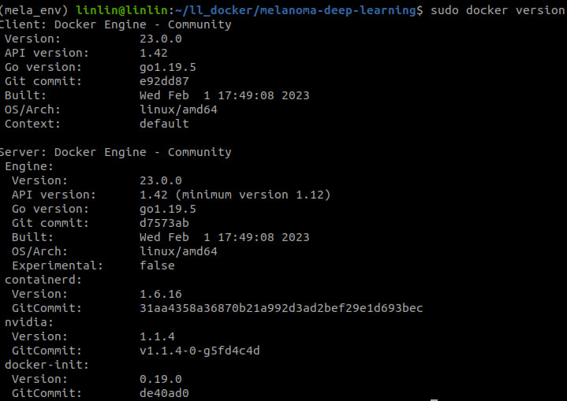

# Docker Environment

## Install Docker Server & Client 
```
# remove the installed docker
sudo apt-get purge docker-ce docker-ce-cli containerd.io docker-buildx-plugin docker-compose-plugin docker-ce-rootless-extras
sudo rm -rf /var/lib/docker
sudo rm -rf /var/lib/containerd

# install
sudo apt-get install docker-ce docker-ce-cli containerd.io docker-compose-plugin

# check docker version
docker version
```


## Build Docker

```
# build image 
docker build -t mela_api:<tag> .

# run docker without gpu
docker run \
-it \
--rm \
-p 12000:12000 \
-p 6006:6006 \
-v /home/linlin/dataset/sports_kaggle:/home/linlin/dataset/sports_kaggle \
-v /home/linlin/ll_docker/melanoma-deep-learning/docker_model/mela_api:/home/linlin/melanoma-deep-learning/mela_api \
mela_api:v2 

# -v $host_path:$container_path
# -v /home/linlin/ll_docker/melanoma-deep-learning/docker_model/mela_api:/home/linlin/melanoma-deep-learning/mela_api \
mela_api:v1 -- mount the events files from mela_api into ./docker_model/mela_api folder (but files are still on docker container, not locally exist)
# -p host_port:container_port, 12000 for flask, 6006 for tensorboard
```

## Train in Docker Container
```
python3 train.py
```

### Access the Tensorboard in Docker  
- Run `python3 -m tensorboard.main --logdir=. --bind_all` on container
- In local pc: `localhost:6006`


## Run API in Docker Container
```
python3 api.py 
```
- In local pc: go to `localhost:12000` to go to flask api 


## Acess 

- Modify the file inside the docker (so docker image would be updated) 

    - terminal 1
    ```
    docker run -v /home/linlin/dataset/sports_kaggle/:/home/linlin/dataset/sports_kaggle/ \
    -it \
    --rm \
    mela_api:<tag>  # docker run: create a new container    
    ```

    - terminal 2 
    ```
    docker exec -it mela_api:<tag> /bin/bash  # docker exec: run command on running container
    # modify the file
    # ctrl + d exit
    docker commit -m "message" <container id> mela_api:<tag>
    ```

## Save Weights from Container
```
# Syntax to Copy from Container to Docker Host  
docker cp {options} CONTAINER:SRC_PATH DEST_PATH 

# Syntax to Copy from Docker Host to Container  
docker cp {options} SRC_PATH CONTAINER:DEST_PATH 
```

## Save Image
```
docker save mela_api:<tag> > docker_mela_api.tar
docker save myimage:<tag> | gzip > docker_image_mela_api.tar.gz
docker save mela_api:<tag> --output docker_image_mela_api.tar

docker load --input *.tar  #  It restores both images and tags.
docker load < *.tar
```